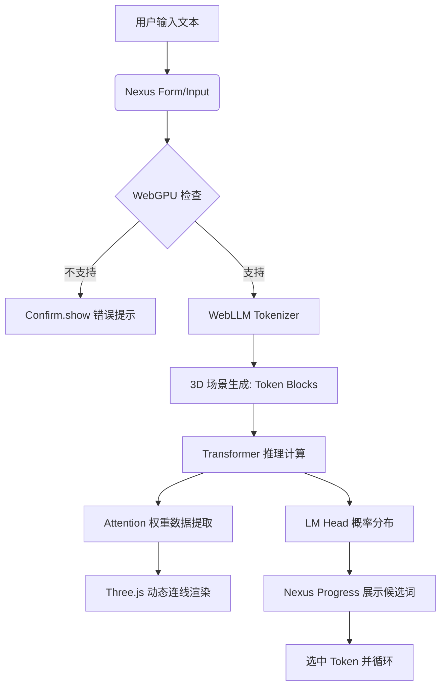

# 产品需求文档 (PRD): “Token 的一生”推理可视化引擎

**版本：** v1.0.0

**状态：** Draft

**负责人：** 资深产品经理 (Gemini)

---

## 1. 项目背景与目标

### 1.1 背景

当前 AI 模型推理过程如同“黑盒”，学习者难以直观理解词元化 (Tokenization)、嵌入 (Embedding) 及注意力机制 (Attention) 的数学美感。

### 1.2 核心目标

* **可视化 (Visualizing)**：将离散的推理数据转化为动态 3D 轨迹。
* **低门槛 (Accessibility)**：基于 Web 访问，利用用户本地 WebGPU 算力，无需后端。
* **交互式教育 (Interactive Learning)**：支持实时参数微调（如 Temperature），观察推理坍缩过程。

---

## 2. 角色与用户故事 (User Persona)

* **学生/初学者**：我需要看到文字如何变成一串数字（ID），再变成一串坐标（Vector）。
* **AI 研究员**：我希望观察 Llama-3 在生成特定 Token 时，Attention Matrix 的分布规律。

---

## 3. 功能详细说明

### 3.1 阶段一：词元化与输入 (The Input Stage)

* **功能描述**：实时接收文本输入并进行分词。
* **UI 实现**：
* 使用 `Form` 组件包裹输入框。
* 结果展示：使用不同背景色的 `Badge` 显示 Token，悬停显示 Token ID。

* **关键 AC**：输入“Hello World”，必须分词为对应 Llama-3 词表的 ID 序列。

### 3.2 阶段二：计算与推理 (The Inference Stage)

* **功能描述**：通过 WebLLM 运行 Llama-3，拦截每层输出。
* **3D 视觉要求**：
* **Embedding 层**：展示色块从 2D 面板飞入 3D 空间的动画。
* **Transformer 层**：层级之间使用 `DeepGlass` 材质的容器隔离。
* **Attention 可视化**：当前生成的 Token 与历史 Token 之间连线的粗细代表权重。

* **交互实现**：使用 `Tabs` 切换查看不同 Block 的计算状态。

### 3.3 阶段三：采样与输出 (The Sampling Stage)

* **功能描述**：展示最后一步 Softmax 的概率分布。
* **交互控制**：
* `Slider` (showValue): 调节 Temperature (0.0 - 2.0) 和 Top-P。
* `Progress`: 实时展示前 5 个候选 Token 的选中概率。

---

## 4. 系统流程图 (System Flow)

*(流程图参考了组件库的异步控制逻辑 及 WebGPU 推理链路)*

---

## 5. 关键技术规范与组件映射

| 模块 | 核心技术/组件 | 关键属性 (Props) |
| --- | --- | --- |
| **状态反馈** | `Progress` | `value={loadPercent}`, `indicator="bg-core-blue"` |
| **层级导航** | `Tabs` | `defaultValue="embedding"`, `variant="navigation"` |
| **参数调节** | `Slider` | `min={0}`, `max={2}`, `step={0.1}`, `showValue` |
| **交互浮窗** | `Popover` | `side="top"`, `sideOffset={12}` |
| **模型配置** | `Select` | 选择 Llama-3 8B, 70B(远程) 或小型测试模型 |

---

## 6. 非功能性需求

* **性能**：模型加载期间需使用 `Dialoger` 配合全屏 `Loading` 动画，防止用户操作干扰。
* **兼容性**：检测到不支持 WebGPU 的浏览器需通过 `Confirm.show` 强制拦截。
* **体验**：利用 `FrostGlass` 材质提升暗色模式下的科技感。